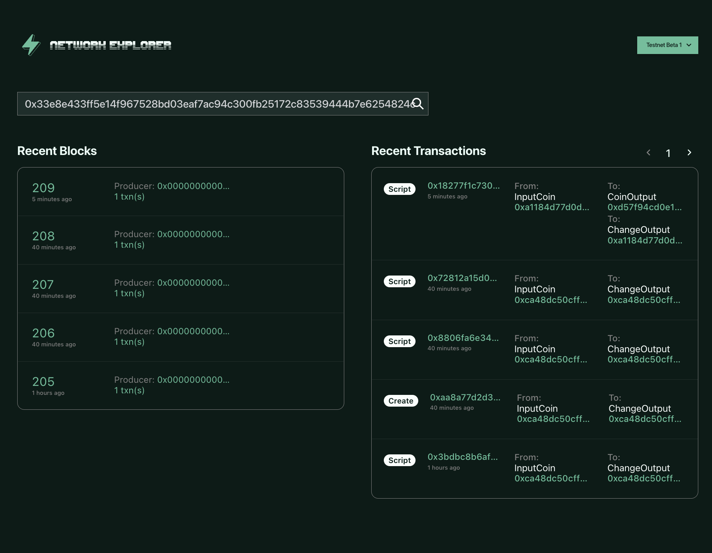

# Documentation Playbook

## Introduction

Welcome to our Documentation Playbook! This guide is designed to help you produce consistent documentation that is easy to read, understand, and use. By following the guidelines outlined in this playbook, you can ensure that your documentation is professional, accurate, and consistent in tone, voice, and formatting.

<br>

## Target Audience

Before you start writing your documentation, it's important to define your target audience. This will help you choose the appropriate tone and voice for your documentation, as well as determine the level of technical detail that you need to include.

Our target audience includes developers, technical writers, project managers, and other stakeholders who are involved in building and using our products and services. We assume that our readers have a basic understanding of programming concepts and terminology.

<br>

## Tone and Voice

Borrowed from [Microsoft](https://learn.microsoft.com/en-us/style-guide/top-10-tips-style-voice) and [Digital Ocean](https://www.digitalocean.com/community/tutorials/digitalocean-s-technical-writing-guidelines)

1. Friendly but formal

- do not include jargon, memes, excessive slang, or emojis.
- Use second person to keep the focus on the reader and what they'll accomplish (e.g., "You will configure..")

2. Define acronyms and project-specific terms upfront

If you're using acronyms or words that the general audience may not understand, you should define these upon the first use. Then, you can use the acronym in subsequent writing.

**Example**
| Recommended ✅                                                                                                                                                     |
|-------------------------------------------------------------------------------------------------------------------------------------------------------------------|
| Sway introduces a new type called Address, which could represent an EOA (externally owned account) or a smart contract. EOAs are the most common type of account. |

2. Use bigger ideas, fewer words
   Shorter is always better.

**Example**
| Recommended ✅             | Not Recommended ❌                                                                                  |
|---------------------------|----------------------------------------------------------------------------------------------------|
| Ready to buy? Contact us. | If you're ready to purchase Office 365 for your organization, contact your account representative. |

3. Write like you speak
   Read your text aloud.

Does it sound like something a real person would say? Be friendly and conversational. No. Robot. Words.

**Example**
| Recommended ✅                                            | Not Recommended ❌ |
|----------------------------------------------------------|-------------------|
| You need an ID that looks like this: someone@example.com | Invalid ID        |

4. Lead with verbs
   Most of the time, start each statement with a verb. Edit out you can and there is, there are, there were. To learn more, see Verbs and Word choice.

**Example**
| Recommended ✅                                                                         | Not Recommended ❌                                                                     |
|---------------------------------------------------------------------------------------|---------------------------------------------------------------------------------------|
| Store files online, access them from all your devices, and share them with coworkers. | You can access apps across your devices, and you get online file storage and sharing. |

<br>

## Structure
Drawn inspiration from [Google](https://developers.google.com/style) and [Digital Ocean](https://www.digitalocean.com/community/tutorials/digitalocean-s-technical-writing-guidelines)

For consistent documentation structure follow the two guides based on Fuel’s two main categories. Follow this template into 

1. Procedural, a tutorial based document to guide a user step by step through a specific task.
2. Conceptual, a piece of documentation which helps the user run through a general topic down to its specifics. 

| Procedural                                                                                                                                               | Conceptual                                                                                                                                         |
|----------------------------------------------------------------------------------------------------------------------------------------------------------|----------------------------------------------------------------------------------------------------------------------------------------------------|
| 1. Title (h1)<br>2. Introduction (h3)<br>3. Prerequisites (h2)<br>4. Step 1 — Writing X (h2)<br>...<br>5. Step n — Building Y (h2)<br>6. Conclusion (h2) | 1. Title (h1)<br>2. Introduction (h3)<br>3. Prerequisites (optional) (h2)<br>4. Subtopic X (h2)<br>...<br>5. Subtopic Y (h2)<br>6. Conclusion (h2) |

When writing your guide you should be asking yourself questions about how this tutorial or article is going to benefit the reader and what they will accomplish. 

### Title (h1)

The purpose of the title should explicitly answer the question, "What is the goal of this task?" in under 60 characters while being as specific as possible.

**Template**
How to "task" with "software" on "infrastructure" 

**Example**
| Recommended ✅                                                  |
|----------------------------------------------------------------|
| How to deploy a Sway smart contract on the Fuel beta-3 testnet |
### Introduction (h3)

In one to three paragraphs, motivate the reader about the expectations of this tutorial, emphasizing what they will accomplish, not just learn. Answer questions like:

1. What the tutorial is about
2. Why the reader should be learning this topic
3. What will the reader do or create in this tutorial
4. What will they have accomplished by the end

**Example**

| Recommended ✅                                                                                                                                                                                                                                                                                  |
|------------------------------------------------------------------------------------------------------------------------------------------------------------------------------------------------------------------------------------------------------------------------------------------------|
| In this tutorial you will be writing a simple token smart contract smart contract and deploying int onto Fuel's beta-3 testnet. By the end you will be have a good grasp of the full Fuel suite from writing basic Sway code, to using the Fuel's Rust SDK for testing and the Forc toolchain. |

### Prerequisites (h2)
To ensure the reader is successful in the tutorial, spell out exactly what they should have done or installed. Create a list of specific points linking to existing Fuel tutorials. It's important to be specific, as users can become easily discouraged if they are stuck on the first step due to a missing install. Additionally, avoid repeating documentation that already exists. Instead, point the user to relevant resources, such as the quick start guide for installing the Fuel suite. Always be specific and never assume.

**Example**
| Recommended ✅                                                                                                                                                                                                                                                 | Not Recommended ❌                                                                                            |
|---------------------------------------------------------------------------------------------------------------------------------------------------------------------------------------------------------------------------------------------------------------|--------------------------------------------------------------------------------------------------------------|
| In order to go through this tutorial you will have to <br>1. Have install `Rust` and it's toolchain `rustup` [here](https://www.rust-lang.org/tools/install) <br>2. Have install fuel's toolchain manager,`fuelup` [here](https://github.com/FuelLabs/fuelup) | In order to go through this tutorial you will have to <br>1. Have rust installed<br>2. Have fuel's toolchain |

Be concious about misselaneous tools that they need. Could be `git`, `node` or any accounts they need. Always be specific and never assume.

### Steps (h2) and Content (p)

Be as granular as possible in your instructions. First, explain to the reader what they need to do and why. Never assume. Then, provide a direct command, such as "you will build," and sandwich it between an explanation of what the command does and the purpose of the command. Avoid using questions like "we will learn" and instead focus on the reader. Ask yourself questions like

1. What does the command acheive?
2. Command
3. What are the details of the command?
   1. What arguments are used and why?
   2. Why your reader is using them

If the command yields an output always display it in a separate block.

<table>
<tr>
<td> Recommended ✅</td> <td> Not Recommended ❌</td>
</tr>
<tr>
<td>

`forc` command will compile the current project.

```bash
$ forc build --error-on-warnings
```

The `--error-on-warnings` flags will treat any warnings to be errors. This can be useful for catching unclean code like unused storage declarations. Use 

```bash
Compiled library "core".
Compiled library "std".
Compiled contract "fuel-token".
Bytecode size is 332 bytes.
```

</td>

<td>

`forc` command will compile the current project.

```bash
$ forc build --error-on-warnings
   Compiled library "core".
   Compiled library "std".
   Compiled contract "fuel-token".
   Bytecode size is 332 bytes.
```

</td>
</tr>
<tr>
</tr>
</table>

### Transitions (p)
Introduction sentences for each step and closing transitions should be used to help the reader internalize what they have just completed and understand the upcoming step. This serves as checkpoints to ensure that the reader has properly understood and completed each step.

**Example**
| Recommended ✅                                                                                                                                                        |
|----------------------------------------------------------------------------------------------------------------------------------------------------------------------|
| Now that you have written your first Sway contract, you will need to ensure that it builds correctly. To do this, you will need to refer back to the `forc` toolchain. |

### Conclusions (h2)
Try to summarize what the reader has accomplished during this tutorial or what they have learned from it. Continue focusing on the reader by suggesting the next tutorials, documentation, or articles they can explore in the Fuel ecosystem. Also, point them to the Fuel Forum for users to reach out about any issues they are having.

**Example**
| Recommended ✅                                                                                                                                                                                                                                                                                              |
|------------------------------------------------------------------------------------------------------------------------------------------------------------------------------------------------------------------------------------------------------------------------------------------------------------|
| Congratulations! Now that you have successfully built and deployed a Sway smart contract on the Fuel beta testnet, you can apply that knowledge to more complex contracts. Take a look at the [ Sway Applications repository ]( https://github.com/FuelLabs/sway-applications ) for inspiration and ideas. |

<br>

## Formatting

All of the documentation for Fuel is in Markdown. To ensure consistency in formatting, we recommend adhering closely to the following ruleset.

### Headers

Each section of tutorials requires a header. As a rule of thumb, use H3s sparingly and avoid using H4s whenever possible.

1. H1 headers are reserved for:
   - Titles
2. H2 headers are used for:
   - Defining prerequisites
   - Steps in a tutorial
   - Conclusions
3. H3 headers are used for:
   - Introductions

For a step based tutorials, **-ing** words should be used. 

**Example**
| Recommended ✅                               | Not Recommended ❌                        |
|---------------------------------------------|------------------------------------------|
| # Deploying your Sway contract to the testnet | # Deploy your Sway contract to the testnet |

### Inline Text
   
When looking to include any of the following in **bold**, *italics*, or `code` inline within your explanatory text, ensure that it is used in the appropriate context.

| **Bold**                                                                                                        | _Italics_                      | `Code`                                                                                                                             |
|-----------------------------------------------------------------------------------------------------------------|--------------------------------|------------------------------------------------------------------------------------------------------------------------------------|
| 1. Visible GUI text<br>2. Hostnames usernames<br>3. Term lists<br>4. Emphasis when changing context for command | 1. Introducing technical terms | 1. Commands<br>2. Package names<br>3. Optional commands<br>4. Filenames and paths<br>5. Example URLs<br>6. Ports<br>7. Key Presses |

### Code blocks
Code blocks should be used for items such as execution commands, files and scripts, outputs, and interactive dialogs only. Essentially, anything that the user can copy and paste into their own system.

1. File omissions should always use ellipses (...)

   ```rust
   contract;

   ...

   impl HelloModular for Contract {
      #[storage(read)]
      fn greet() -> str[16] {
         storage.greet
      }
   }
   ```

2. Use code blocks with the appropriate command line highlighting when possible. Utilize the "$" symbol to indicate a command line is being used.

   > This example creates a new Sway project called `fuel-token` in your home directory. Change it to a token name you like.
   ```bash
   $ cd
   $ forc new fuel-token
   ```


### Images and diagrams

When including images in your tutorial, use a brief caption to provide context for the image. Images should always be paired with alt text in case of rendering issues. A concise caption should also be included to give the image context. Make sure the image is as small as possible to avoid taking up unnecessary space.

| Recommended ✅                                   | Not Recommended ❌                                                             |
|-------------------------------------------------|-----------------------------------------------------------------------------|
| 1. GUIs<br>2. Interactive dialog<br>3. Diagrams | 1. Code<br>2. Config files<br>3. Outputs <br>4. Anything that can be copied |

**Example**

<figure class="image">

<figcaption>Caption for block explorer</figcaption>
</figure>
